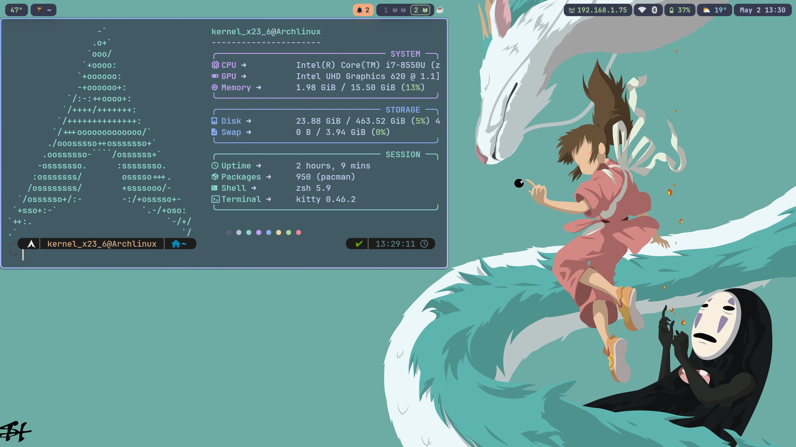
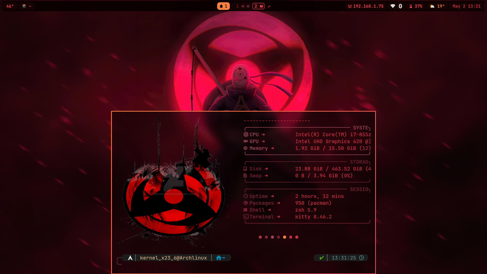

# my-hyprland-dotfiles

Hyprland rice for Arch Linux with a dual-theme system: **macchiato** (Catppuccin Mocha, daily use) and **matrix** (red-on-black, for when the mood calls for it). Theme switching is live with  one click in the bar or shortcut from keyboard and every component updates without restarting anything.

---

## Preview




---

## Components

| Role | Tool |
|---|---|
| Compositor | Hyprland |
| Bar | Waybar |
| Terminal | Kitty |
| Notification center | sway-notification-center |
| App launcher | Rofi (Wayland) |
| Fetch | Fastfetch |
| Logout screen | wlogout |
| System monitor | btop |
| Wallpaper daemon | awww |
| Lock / idle | hyprlock + hypridle |
| Clipboard | cliphist + wl-paste |

**Font:** JetBrainsMono Nerd Font  
**Icons:** Tela-circle-dracula (included as archive in `assets/`)  
**GTK theme:** Catppuccin Mocha (included as archive in `assets/`)

---

## Installation

> Arch Linux only. The script assumes a base bootable system with Hyperland and Kitty installed.

```bash
git clone https://github.com/kernel236/my-hyprland-dotfiles
cd my-hyprland-dotfiles
./install.sh
```

The installer will:
- install all required packages via pacman or yay
- symlink configs to the correct XDG paths
- extract and install the icon pack and GTK theme
- copy scripts to `~/.local/bin/`
- optionally add the BlackArch repository

### BlackArch (optional)

During installation you will be prompted:

```
Add BlackArch repository? [y/N]
```

If you answer yes, the official BlackArch strap script will be downloaded and run. This adds the full BlackArch package repository without converting your system. It coexists cleanly with a standard Arch install. You can skip this and add it later at any time.

---

## Theme switching

Switch theme from the bar (click the theme indicator) or directly from a terminal:

```bash
~/.config/waybar/scripts/theme-switch.sh macchiato
~/.config/waybar/scripts/theme-switch.sh matrix
```

The script updates symlinks for Hyprland, Waybar, Kitty, swaync, Rofi and Fastfetch simultaneously. No restart needed.

---

## Wallpapers

Wallpapers are split by theme in `assets/backgrounds/`:

- `whitehat/` — used with macchiato (anime, landscapes, Studio Ghibli)
- `blackhat/` — used with matrix (dark Arch, Uchiha, BlackArch)

The wallpaper picker (`Super + W`) opens a Rofi gallery. You can also set a random wallpaper from the current theme's folder automatically on login.

---

## Keybinds

A cheatsheet overlay is available at any time with `Super + F1`. All bindings are defined in `hyprland/conf/keybinds.conf`.

---

## Structure

```
my-hyprland-dotfiles/
├── hyprland/       config, themes, scripts
├── waybar/         bar config, per-module CSS, scripts, themes
├── kitty/          terminal config and themes
├── swaync/         notification center config and themes
├── rofi/           launcher, wallpaper picker, themes
├── fastfetch/      per-theme fetch configs
├── wlogout/        logout screen layout and icons
├── btop/           system monitor config
├── assets/         wallpapers, icon pack, GTK theme archive
└── scripts/        rofi-launcher, rofi-clipboard, rofi-wallpaper
```
